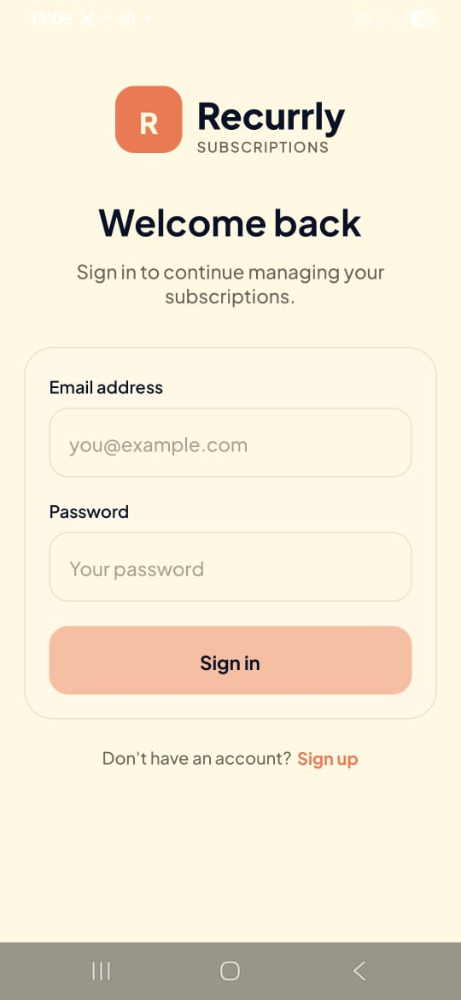
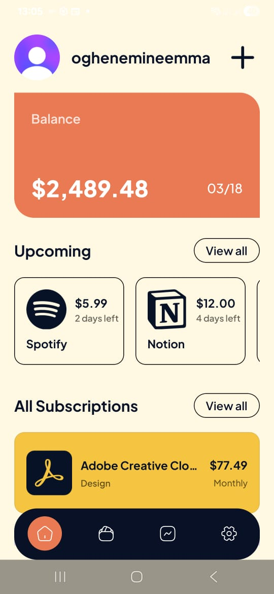
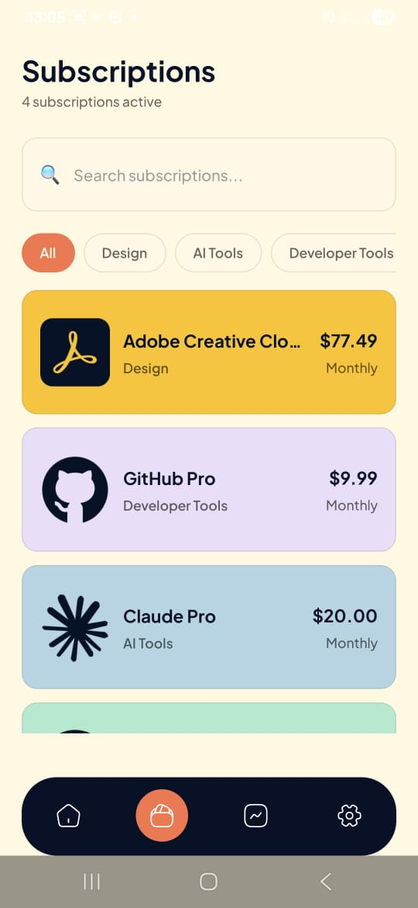
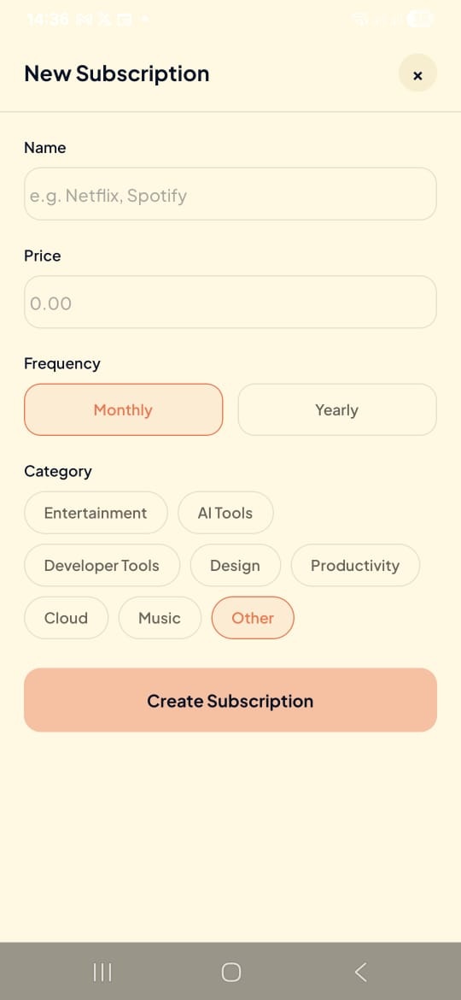
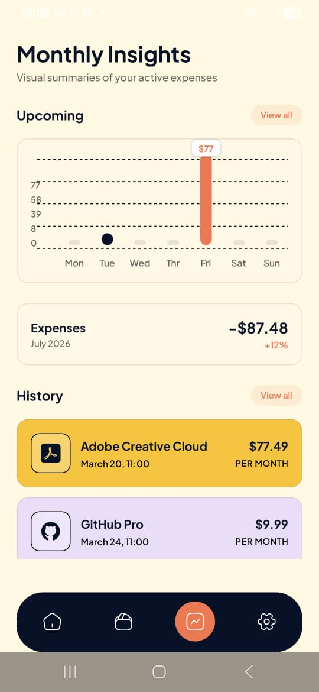
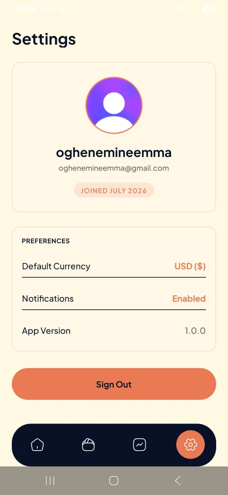

# Recurrly 💳

A premium, modern, and high-fidelity React Native mobile application for tracking active subscriptions and recurring expenses. Built with Expo SDK 54, Clerk authentication, Tailwind styling, and PostHog tracking.

---

## 🚀 Download & Installation

You can download the compiled standalone APK or scan the install QR code directly from the Expo Build portal:
👉 **[Download Recurrly APK (EAS Build Portal)](https://expo.dev/accounts/mineh/projects/react_native-recurrly/builds/61fd74b4-a914-423a-b665-202277fa6a3e)**

---

## 📱 Screenshots

Here is a visual walk-through of the application screens:

| Sign In | Home / Dashboard | Subscriptions |
|:---:|:---:|:---:|
|  |  |  |

| Create Subscription | Monthly Insights | Settings |
|:---:|:---:|:---:|
|  |  |  |

---

## ✨ Features

- **Secure Clerk Authentication**: Dynamic signup, login, email verification, and persistent session recovery with token-cached secure storage.
- **Searchable Subscription list**: Real-time fuzzy filtering of active subscriptions by name with horizontal category chip filtering (Entertainment, AI Tools, Developer Tools, Design, Productivity, Cloud, Music, etc.).
- **Global State Synchronization**: Shared state provider syncing data in real-time across Home, Subscriptions, and Insights screens.
- **Dynamic Weekly Insights**: Proportional daily spending bar chart showing real aggregated expenses based on actual active subscription renewal dates.
- **Smooth Page Transitions**: Custom layouts that eliminate white-screen flashes by honoring the cream-colored dark/light styling.
- **PostHog Analytics**: Tracks subscription events (`subscription_created`, etc.) dynamically for product insights.

---

## 🛠️ Technology Stack

- **Framework**: React Native & Expo SDK 54 (File-based Routing, Safe Area Layouts)
- **Authentication**: Clerk v6 (`@clerk/expo` and `@clerk/shared`)
- **Styling**: NativeWind (Tailwind CSS v4 engine)
- **Date Management**: Day.js
- **Database / State**: React Context API (Global Provider)
- **Analytics**: PostHog React Native
- **Build System**: EAS (Expo Application Services) CLI

---

## 💻 Local Development

### 1. Prerequisite Configuration
Create a `.env` file in the root directory:
```env
EXPO_PUBLIC_CLERK_PUBLISHABLE_KEY=your-clerk-publishable-key
EXPO_PUBLIC_POSTHOG_PROJECT_TOKEN=your-posthog-project-token
EXPO_PUBLIC_POSTHOG_HOST=https://us.i.posthog.com
```

### 2. Run the App
Install local node dependencies and start the Metro development server:
```bash
# Install dependencies
npm install

# Run on Android Emulator or connected physical device
npx expo start -c
```
*Press `a` in the terminal to open on Android.*

---

## 🛠️ Build Commands

All production releases are configured via `eas.json` inside the project root:

* **Build Android APK (Testing)**:
  ```bash
  eas build --platform android --profile preview
  ```
* **Build Android App Bundle (AAB - Play Store Submission)**:
  ```bash
  eas build --platform android --profile production
  ```
